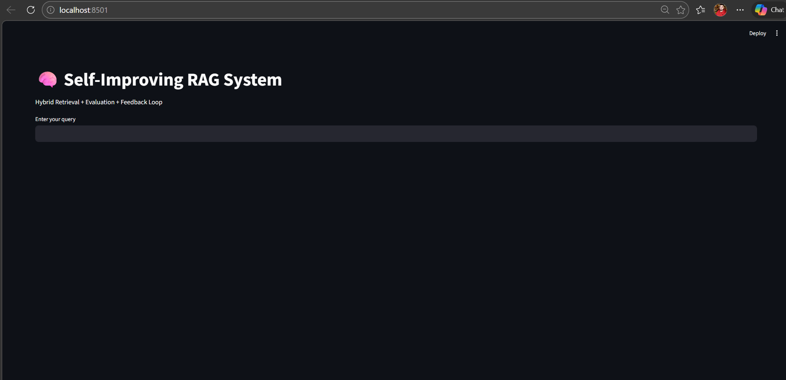
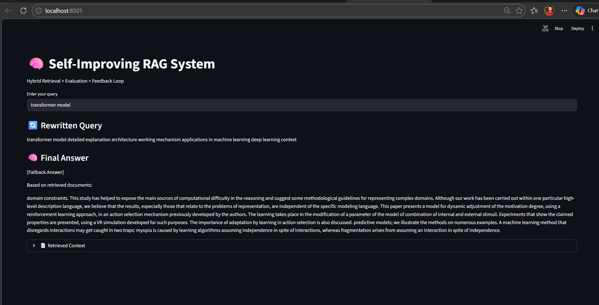
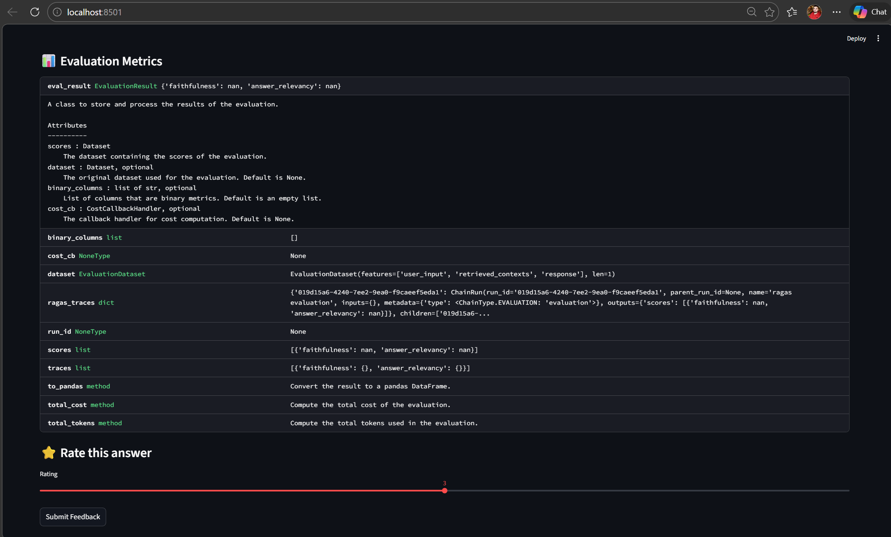

# 🧠 Self-Improving RAG System

------------------------------------------------------------------------

## 🚀 Overview

A **production-grade Self-Improving Retrieval-Augmented Generation (RAG)
system** that demonstrates:

-   Hybrid Retrieval (BM25 + Vector Search)
-   Query Rewriting using LLM
-   Answer Generation with fallback (no API dependency)
-   RAG Evaluation (Faithfulness + Relevancy)
-   Feedback Loop for continuous improvement
-   Interactive Streamlit UI

------------------------------------------------------------------------

## 📸 Screenshots

> Add screenshots in `screenshots/` folder

### 🔹 UI Overview

### 🔹 Query & Answer

### 🔹 Evaluation Metrics

------------------------------------------------------------------------

## 🏗️ System Architecture

    User Query
       ↓
    Query Rewriter (LLM)
       ↓
    Hybrid Retrieval (BM25 + Vector DB)
       ↓
    Answer Generator (LLM / Fallback)
       ↓
    Evaluation (RAGAS)
       ↓
    Feedback Loop → Improvement

------------------------------------------------------------------------

## 🛠️ Tech Stack

-   **LLM**: OpenAI GPT (fallback supported)
-   **Vector DB**: ChromaDB
-   **Embeddings**: Sentence Transformers
-   **Retrieval**: BM25 + Semantic Search
-   **Evaluation**: RAGAS
-   **UI**: Streamlit
-   **Backend**: Python

------------------------------------------------------------------------

## 📂 Project Structure

    self-improving-rag/
    │
    ├── app/
    │   ├── main.py
    │   ├── ui.py
    │   ├── retriever.py
    │   ├── generator.py
    │   ├── evaluator.py
    │   ├── feedback.py
    │   ├── improver.py
    │   ├── query_rewriter.py
    │
    ├── config/
    │   └── settings.py
    │
    ├── data/ (ignored)
    ├── screenshots/
    ├── requirements.txt
    ├── README.md

------------------------------------------------------------------------

## ⚙️ Setup Instructions

### 1. Clone Repository

    git clone https://github.com/YOUR_USERNAME/self-improving-rag.git
    cd self-improving-rag

### 2. Create Virtual Environment

    python -m venv venv
    venv\Scripts\activate

### 3. Install Dependencies

    pip install -r requirements.txt

### 4. (Optional) Add OpenAI API Key

Create `.env` file:

    OPENAI_API_KEY=your_key_here

------------------------------------------------------------------------

## 📊 Dataset (Optional)

Download from Kaggle:

**arXiv Scientific Dataset**

Place inside:

    data/arXiv_scientific dataset.csv

⚠️ If not provided → app uses fallback data

------------------------------------------------------------------------

## ▶️ Run Application

### CLI Mode

    python -m app.main

### Streamlit UI

    streamlit run app/ui.py

------------------------------------------------------------------------

## 📊 Evaluation Metrics

-   **Faithfulness** → grounded in retrieved context\
-   **Answer Relevancy** → matches user query

------------------------------------------------------------------------

## 🔁 Feedback Loop

-   User rates answer (1--5)
-   Poor responses tracked
-   System improves future queries

------------------------------------------------------------------------

## 💡 Why This Project Stands Out

-   Real-world GenAI system design\
-   Hybrid retrieval (industry-level)\
-   Evaluation pipeline (rare)\
-   Self-improving architecture\
-   Production-ready handling (fallbacks, scalability)

------------------------------------------------------------------------

## 📈 Future Improvements

-   Cross-encoder re-ranking\
-   Agentic RAG\
-   Persistent vector DB\
-   Multi-source ingestion\
-   LangSmith tracing

------------------------------------------------------------------------

## 👨‍💻 Author

**Tonumay Bhattacharya**

------------------------------------------------------------------------

## ⭐ Support

If you found this useful, give it a ⭐ on GitHub!
